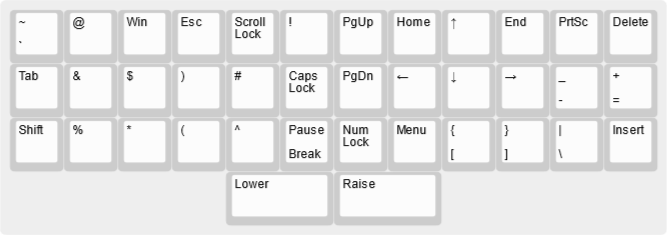

# 100110B the ortholinear mechanical keyboard

100110B is my custom design of the 40% ortholinear mechanical keyboard.

## 100110B Layers

These are the layers of the Prism keyboard.

I  designed the layouts of these layers to be very easy to remember.

### Default

The default layer is based on the standard QWERTY layout
of the alphanumerical part of the full size keyboard
or the 60% keyboard. This section is identical to the Planck keyboard,
only 100110B sports much fewer keys
and there is a split space bar on the bottom.

[`100110B-default-layer.json`](100110B-default-layer.json):

### Raise

The Raise layer introduces function keys F1 - F12
and numbers arranged in a numpad style.

[`100110B-raise-layer.json`](100110B-raise-layer.json):

(There are still three unused keys.)

### Lower

The Lower layer introduces the nav cluster:
PgUp, PgDn, Home, End, Insert, Delete keys
and the arrow keys in the ijkl shape.

The three missing symbol keys to the right of the **P** key
moved to the right of the **M** key,
two keys from number row to the right of the **0** key
moved to the right of the **L** key.

[`100110B-lower-layer.json`](100110B-lower-layer.json):

Other symbols from the number row dwell on letters
based on the shapes they resemble.

| Symbol | Key |
| ------ | --- |
| ! | T |
| @ | Q |
| # | F |
| $ | S |
| % | Z |
| ^ | V |
| & | A |
| * | X |
| ( | C |
| ) | D |

At least this is what they look to me. I hope you get the idea! ;)

More special keys:

| Command | Key |
| ------- | ----|
| PrtSc | P |
| Pause/Break | B |
| Menu | M |
| NumLock | N |
| CapsLock | G |
| ScrollLock | R |

The letters **C** for CapsLock
and **S** for ScrollLock
were already taken for symbols.
So we have to make do with **G**
(which looks almost like **C** for CapsLock)
and **R** (which is contained in the word for ScrollLock).

# Complete 100110B

This is what the 100110B looks like in its full glory!

The [complete 100110B layers definition](100110B-complete.json):

